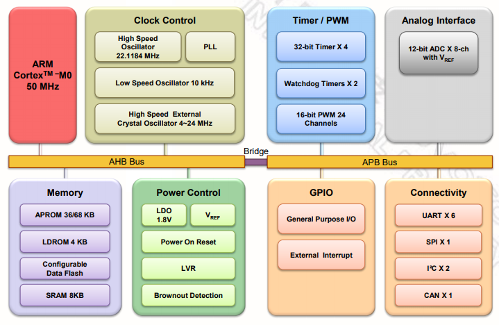

# [NUC131](https://github.com/SoCXin/NUC131)

* [nuvoton](http://www.nuvoton.com.cn/)：[Cortex-M0](https://github.com/SoCXin/Cortex)
* [L3R4](https://github.com/SoCXin/Level)：50 MHz  * 0.95 DMIPS/MHz

## [简介](https://github.com/SoCXin/NUC131/wiki)

[NuMicro® NUC131](https://www.nuvoton.com/products/microcontrollers/arm-cortex-m0-mcus/nuc131-nuc1311-can-series/) 系列内建 22.1184 MHz 高精度晶振 ( 1 % 准确度 ) 。 备有丰富的外设, 如CAN2.0A/B, 定时器, 看门狗定时器,多组 UART , SPI , I²C , PWM , 12位 ADC。

### 关键特性

* CAN 2.0 A/B
* 6 x UART
* 工作电压: 2.5 V ~ 5.5 V
* 工作温度: -40°C ~ 105°C
* 4 KB Data Flash

#### 封装规格

* LQFP48（7*7mm,P0.5mm）
* LQFP64（7*7mm,P0.5mm）

### [资源收录](https://github.com/SoCXin/NUC131)

* [参考文档](docs/)
* [参考资源](src/)
* [参考工程](project/)

### [选型建议](https://github.com/SoCXin)

[NUC131](https://github.com/SoCXin/NUC131) 是 NuMaker UNO的主控芯片

### [探索芯世界 www.SoC.xin](http://www.SoC.Xin)
